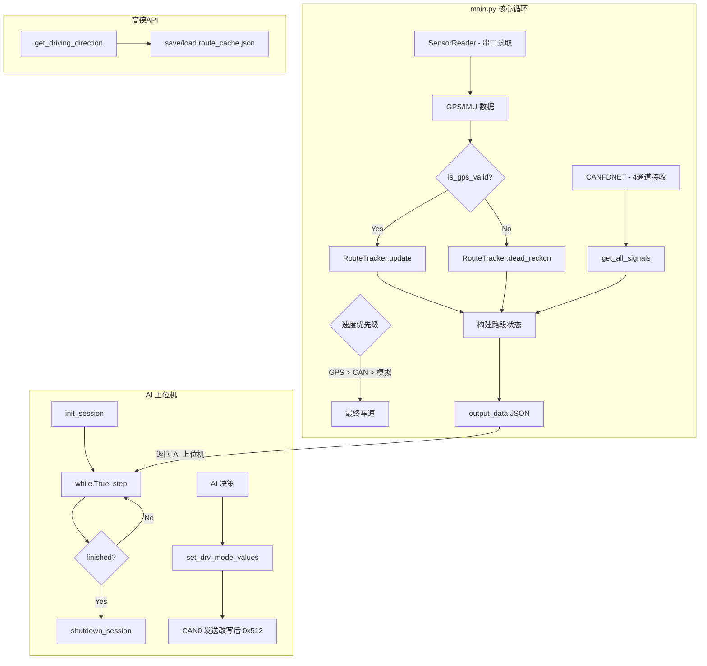

---

## VCU_Motor 项目 API 接口文档

> 生成时间：2026-06-30  
> 项目路径：`d:/MyPython/VCU_motor/`

---

## 目录

1. [项目概述](#1-项目概述)
2. [系统架构](#2-系统架构)
3. [核心 API（main.py）](#3-核心-apimainpy)
4. [路线规划 API（gaode_api.py）](#4-路线规划-apigaode_apipy)
5. [路线跟踪器（route_tracker.py）](#5-路线跟踪器route_trackerpy)
6. [CAN 接口（CANFDNET.py）](#6-can-接口canfdnetpy)
7. [传感器接口（sensor_reader.py）](#7-传感器接口sensor_readerpy)
8. [数据流与数据结构](#8-数据流与数据结构)
9. [配置项说明](#9-配置项说明)
10. [调用示例](#10-调用示例)

---

### 1. 项目概述

本程序是一个车辆控制单元（VCU）监控系统，主要功能包括：

- 通过 **WT901C485 传感器** 读取 GPS / IMU 数据
- 调用 **高德地图 API** 获取路径规划及实时路况
- 通过 **CAN 总线** 读取车辆信号（车速、SOC、驾驶模式、档位等）
- 支持 **GPS 丢失时的航位推算**（Dead Reckoning）
- 支持 **API 失败时的缓存回退**
- 为 AI 上位机提供 `init_session → step → shutdown_session` 三阶段接口

---

### 2. 系统架构




---

### 3. 核心 API（main.py）

#### 3.1 `init_session(origin_addr=None, dest_addr=None) → dict | None`

> 初始化会话，打开传感器、CAN 设备，加载路线。返回 session 字典供后续 `step()` 使用。

| 参数 | 类型 | 必填 | 说明 |
|------|------|------|------|
| `origin_addr` | `str` | 否 | 起点地址或坐标 `"lng,lat"`，默认 `"106.830767,29.716379"` |
| `dest_addr` | `str` | 否 | 终点地址或坐标，默认 `"106.834505,29.715720"` |

**返回值** (`dict`)：

| 键 | 类型 | 说明 |
|------|------|------|
| `reader` | `SensorReader` | 传感器读取器实例 |
| `can_ok` | `bool` | CAN 初始化是否成功 |
| `can_test` | `bool` | 是否启用 CAN 自发自收测试模式 |
| `origin_addr` | `str` | 起点地址 |
| `dest_addr` | `str` | 终点地址 |
| `route_steps` | `list[dict]` | 路线路段列表 |
| `raw_result` | `dict` | 高德 API 原始响应 |
| `tracker` | `RouteTracker` | 路线跟踪器实例 |
| `last_api_refresh` | `float` | 上次 API 刷新时间戳 |
| `finished` | `bool` | 行程是否结束 |
| `segment_states` | `list[dict]` | 全路段运行时状态列表 |

**内部执行流程**：

1. 创建 `SensorReader` 并打开串口
2. 初始化 CAN 设备（`init_can()`），启动 4 通道接收 + 发送 + 诊断线程
3. 如果 `USE_CAN_TEST_TX=True`，启动自发自收测试模式
4. 调用 `init_route_with_cache()` 加载路线（优先 API，失败回退缓存）
5. 初始化 `RouteTracker` 和 `segment_states`

---

#### 3.2 `step(session: dict) → dict | None`

> 执行一次数据处理循环，供 AI 上位机逐帧调用。返回完整的导航与车辆状态数据。

| 参数 | 类型 | 说明 |
|------|------|------|
| `session` | `dict` | `init_session()` 返回的会话字典 |

**返回值** (`dict`)：

```json
{
    "route_summary": {
        "total_distance_km": 2.36,
        "remaining_km": 1.80,
        "progress_pct": 23.7,
        "accumulated_dist_m": 558.0,
        "current_segment": 2
    },
    "segments": [
        {
            "sequence": 1,
            "route": "长安街",
            "instruction": "沿长安街行驶",
            "distance_m": 1200,
            "remaining_distance_m": 0,
            "traffic": "畅通",
            "status": "completed",
            "speed": null,
            "speed_source": null,
            "can_speed": null,
            "driving": "",
            "engy_mode": "",
            "soc": "",
            "gear": "",
            "throttle": "",
            "battery": "",
            "d0_status": "N/A"
        },
        {
            "sequence": 2,
            "route": "南池子大街",
            "instruction": "左转进入南池子大街",
            "distance_m": 800,
            "remaining_distance_m": 642,
            "traffic": "缓行",
            "status": "current",
            "speed": 52.0,
            "speed_source": "gps",
            "can_speed": 51.8,
            "driving": "标准",
            "engy_mode": "EV",
            "soc": "78.5%",
            "gear": "D",
            "throttle": "25.0%",
            "battery": "35°C",
            "d0_status": 0
        }
    ]
}
```

**`route_summary` 字段说明**：

| 字段 | 类型 | 说明 |
|------|------|------|
| `total_distance_km` | `float` | 规划总距离（km） |
| `remaining_km` | `float` | 剩余距离（km） |
| `progress_pct` | `float` | 完成进度百分比（0-100，单调递增） |
| `accumulated_dist_m` | `float` | 累计行驶距离（米） |
| `current_segment` | `int` | 当前所在路段序号（1-based） |

**`segments[i]` 路段字段说明**：

| 字段 | 类型 | 说明 |
|------|------|------|
| `sequence` | `int` | 路段序号（1-based） |
| `route` | `str` | 路段名称 |
| `instruction` | `str` | 导航指令 |
| `distance_m` | `float` | 该路段全长（米） |
| `remaining_distance_m` | `float` | 该路段剩余距离（米） |
| `traffic` | `str` | 路况标签：`"畅通"` / `"缓行"` / `"拥堵"` |
| `status` | `str` | 路段状态：`"completed"` / `"current"` / `"pending"` |
| `speed` | `float` | 当前车速（km/h） |
| `speed_source` | `str` | 车速来源：`"gps"` / `"can"` / `"simulated"` / `"none"` |
| `can_speed` | `float` | CAN 车速原始值（km/h） |
| `driving` | `str` | 驾驶模式：`"ECO"` / `"标准"` / `"SPORT"` / `"自定义"` |
| `engy_mode` | `str` | 能量模式：`"EV"` / `"HEV"` |
| `soc` | `str` | 电池 SOC，如 `"78.5%"` |
| `gear` | `str` | 档位：`"P"` / `"R"` / `"N"` / `"D"` |
| `throttle` | `str` | 油门踏板开度，如 `"25.0%"` |
| `battery` | `str` | 电池温度，如 `"35°C"` |
| `d0_status` | `str` | 惯导收敛状态 |

**内部执行流程（每帧）**：

1. 读取传感器数据 → 打印 GPS 信息
2. 判断是否到达终点 → 是则标记 `finished` 返回 `None`
3. 判断 GPS 有效性（`is_gps_valid`）
4. 读取 CAN 信号（`get_all_signals`）
5. 车速优先级：GPS地速 > CAN车速 > 模拟车速
6. GPS有效 → `tracker.update()`，无效 → `tracker.dead_reckon()`
7. 每隔 `API_REFRESH_INTERVAL` 秒刷新路况
8. 构建 `segment_states` 和最终 JSON 输出

---

#### 3.3 `shutdown_session(session: dict) → None`

> 关闭会话，释放所有资源。

**内部流程**：停止测试发送 → 关闭 CAN → 关闭传感器串口。

---

#### 3.4 辅助函数

**速度相关**：

| 函数 | 签名 | 说明 |
|------|------|------|
| `get_simulated_speed()` | `() → float` | 从 `SIMULATED_SPEEDS` 列表随机返回车速，保持 `SPEED_CHANGE_INTERVAL` 秒不变 |
| `is_gps_valid(data)` | `(dict) → bool` | 判断 GPS 有效：坐标不为空、不为(0,0)、在合理范围、卫星数≥4、PDOP<10 |

**CAN 信号翻译**：

| 函数 | 输入 | 输出 | 映射 |
|------|------|------|------|
| `translate_dyn_mode(value)` | `0\|1\|2\|3` | `"ECO"\|"标准"\|"SPORT"\|"自定义"` | `DYN_MODE_MAP` |
| `translate_gear(value)` | `0\|1\|2\|3` | `"P"\|"R"\|"N"\|"D"` | `GEAR_MAP` |
| `translate_engy_mode(value)` | `0\|1` | `"EV"\|"HEV"` | `ENGY_MODE_MAP` |

**地址/坐标处理**：

| 函数 | 签名 | 说明 |
|------|------|------|
| `is_coordinate(text)` | `(str) → bool` | 判断字符串是否为 `"lng,lat"` 纯坐标格式 |
| `parse_coordinate(text)` | `(str) → str` | 解析并归一化坐标，校验范围 (-180~180, -90~90) |
| `to_coordinate(addr)` | `(str) → str` | 智能转换：坐标直传，地址调用 `get_geocode()` |

**输出**：

| 函数 | 说明 |
|------|------|
| `print_sensor_data(data)` | 打印完整传感器数据（加速度、角速度、角度、磁场、GPS） |
| `print_gps_info(data)` | 仅打印 GPS 相关字段 |
| `format_sensor_output(data)` | 将传感器数据序列化为 JSON 字符串 |

---

### 4. 路线规划 API（gaode_api.py）

> 封装高德地图 V5 驾车路径规划 + V3 地理编码 API。
> API 文档：https://lbs.amap.com/api/webservice/guide/api/direction

#### 4.1 `get_geocode(address, city=None) → str | None`

| 参数 | 类型 | 必填 | 说明 |
|------|------|------|------|
| `address` | `str` | 是 | 结构化地址，如 `"重庆北站北广场"` |
| `city` | `str` | 否 | 限定查询城市，如 `"深圳"` |

返回值：`"lng,lat"` 格式（如 `"116.397428,39.90923"`），失败返回 `None`。

---

#### 4.2 `get_driving_direction(**params) → dict | None`

| 参数 | 类型 | 必填 | 说明 |
|------|------|------|------|
| `origin` | `str` | 是 | 起点坐标 `"lng,lat"` |
| `destination` | `str` | 是 | 终点坐标 `"lng,lat"` |
| `strategy` | `int` | 否 | 策略：0速度优先/1费用/2距离/10躲避拥堵/32大路 |
| `waypoints` | `str` | 否 | 途经点，多个用 `"\|"` 分隔 |
| `show_fields` | `str` | 否 | 返回字段控制，如 `"tmcs,cost,polyline"` |

返回值：高德 V5 API 完整 JSON 响应（dict），失败返回 `None`。

**实际调用示例**：
```python
result = get_driving_direction(
    origin="106.830767,29.716379",
    destination="106.834505,29.715720",
    show_fields="tmcs,cost,polyline",
)
```

---

#### 4.3 `build_route_steps(result: dict) → list[dict] | None`

> 从 API 响应中构建 RouteTracker 所需的路段列表。

返回值每个元素：

| 字段 | 类型 | 说明 |
|------|------|------|
| `step_index` | `int` | 路段索引（0-based） |
| `road_name` | `str` | 路段名称，为空时用 instruction 代替 |
| `instruction` | `str` | 导航指令文本 |
| `distance` | `float` | 路段距离（米） |
| `traffic` | `str` | 路况标签 |
| `polyline` | `str` | 坐标点串 `"lng,lat;lng,lat;..."` |

---

#### 4.4 其他 API 函数

| 函数 | 说明 |
|------|------|
| `save_route_cache(raw_result)` | 将 API 响应存入 `code/route_cache.json` |
| `load_route_cache()` | 从 `route_cache.json` 加载缓存，失败返回 `None` |
| `extract_route_sequences(result)` | 提取简单路线序列（向后兼容），返回 `{"sequence1": {...}, ...}` |
| `parse_driving_result(result)` | 解析并打印完整路径规划结果 |

---

#### 4.5 `init_route_with_cache(origin_addr, dest_addr) → (list, dict)`

> 获取路线规划（优先 API，失败加载缓存）。内部调用 `to_coordinate()` → `get_driving_direction()` → `build_route_steps()`。

---

### 5. 路线跟踪器（route_tracker.py）

#### 5.1 `class RouteTracker`

> 维护车辆在规划路线上的当前位置。支持 GPS 正常定位和 GPS 丢失时的航位推算。

**构造函数**：

```python
RouteTracker(route_steps: list[dict])
```

**核心方法**：

| 方法 | 签名 | 说明 |
|------|------|------|
| `update()` | `(lat, lon, speed, timestamp) → dict` | GPS 有效时调用：先坐标匹配路段，再用速度沿路线推进 |
| `dead_reckon()` | `(speed, timestamp) → dict` | GPS 丢失时调用：通过车速 × 时间推算距离，沿路线推进 |
| `reload_steps()` | `(new_steps, lat, lon) → None` | API 刷新后重新加载路段，GPS 重新定位 |
| `get_current_step()` | `() → dict \| None` | 返回当前路段 dict |
| `get_progress_pct()` | `() → float` | 返回完成百分比（0~100，单调递增） |
| `is_finished()` | `() → bool` | 是否已走完所有路段 |

**关键属性**：

| 属性 | 类型 | 说明 |
|------|------|------|
| `current_step_idx` | `int` | 当前所在路段索引 |
| `distance_in_step` | `float` | 当前路段已行驶距离（米） |
| `gps_lost` | `bool` | GPS 是否丢失 |
| `last_valid_lat` / `last_valid_lon` | `float` | 持久保存的最后有效坐标 |
| `accumulated_dist` | `float` | GPS 丢失期间累计距离（米） |
| `original_total_distance` | `float` | 固定总距离（米，初始化后不变） |
| `cumulative_distance` | `float` | 累计行驶距离高水位标记（只增不减） |

**内部算法**：

- **GPS 有效定位**：用 Haversine 公式计算最近路段（当前 ±5 窗口，偏差 >500m 时全路线搜索）
- **航位推算**：`距离(m) = 速度(km/h) × 时间差(秒) / 3.6`，沿路线逐步推进
- **进度百分比**：分母固定为 `original_total_distance`，分子使用高水位标记确保单调递增

---

### 6. CAN 接口（CANFDNET.py）

> 基于 ZLG CANFDNET 系列设备的 CAN/CANFD 通信模块，支持 4 通道同时收发、DBC 信号解码。

#### 6.1 设备生命周期

```python
init_can()        # → bool   初始化设备 + DBC 加载 + 启动所有后台线程
shutdown_can()    # → None   停止线程 + 复位通道 + 关闭设备
```

**`init_can()` 启动的后台线程**：

| 线程 | 数量 | 职责 |
|------|------|------|
| 接收线程 | 4 个（每通道1个） | 持续读取 CAN/CANFD 报文，DBC 解码，写入 `g_latest_decoded_signals` |
| 发送线程 | 1 个 | 事件驱动：CAN2 收到 0x512 后发送 V2_BSI_512 到 CAN0 |
| 诊断线程 | 1 个 | 5Hz 监控 CAN0 0x512 收发健康状态（看门狗计数器） |

---

#### 6.2 `get_all_signals() → dict`

> 统一外部读取接口，返回所有 DBC 信号物理值。

**返回值示例**：

```json
{
    "STDE_DRV_DYN_MODE_STATE": 1,
    "STDE_DRV_ENGY_MODE_STATE": 0,
    "HV_BATT_SOC": 78.5,
    "HV_BATT_TEMP_AVG": 35.0,
    "POS_MONOSTABLE_LEVER": 3,
    "EFCMNT_PDLE_ACCEL_228": 25.0,
    "VITESSE_VEHICULE_ROUES": 50.0,
    "_watchdog_fault": false
}
```

**可用信号一览**：

| 信号名 | 来源 CAN ID | 物理含义 | 单位 |
|------|------|------|------|
| `VITESSE_VEHICULE_ROUES` | `0x38D` (CAN2) | 轮速车速 | km/h |
| `STDE_DRV_DYN_MODE_STATE` | `0x5E2` (CAN2) | 驾驶模式状态 | 0=ECO, 1=标准, 2=SPORT, 3=自定义 |
| `STDE_DRV_ENGY_MODE_STATE` | `0x5E2` (CAN2) | 能量模式状态 | 0=EV, 1=HEV |
| `HV_BATT_SOC` | `0x5A2` (CAN2) | 高压电池 SOC | % |
| `HV_BATT_TEMP_AVG` | `0x522` (CAN2) | 电池平均温度 | °C |
| `POS_MONOSTABLE_LEVER` | `0x4FE` (CAN2) | 单稳态档位 | 0=P, 1=R, 2=N, 3=D |
| `EFCMNT_PDLE_ACCEL_228` | `0x228` (CAN1/CAN2) | 油门踏板开度 | % |
| `EFCMNT_PDLE_ACCEL_278` | `0x278` (CAN1) | 油门踏板开度（备选） | % |
| `_watchdog_fault` | (诊断) | CAN0 0x512 发送中断标志 | bool |

**通道绑定规则**（`CAN_MSG_CHANNEL_MAP`）：

| CAN ID | 允许通道 | 说明 |
|------|------|------|
| `0x278` | CAN1 | CMM_278 |
| `0x228` | CAN1, CAN2 | CMM_228 |
| `0x512` | CAN2 | V2_BSI_512 |
| `0x5E2` | CAN2 | VCU_5E2 |
| `0x5A2` | CAN2 | VCU_5A2 |
| `0x4FE` | CAN2 | ESM_4FE |
| `0x38D` | CAN2 | ABR_38D |
| `0x522` | CAN2 | E_VCU_522 |
| `0x03C` | CAN3 | 03C |

---

#### 6.3 `set_drv_mode_values(engy_mode, dyn_mode) → None`

> ⚠️ **重要**：这是 AI 上位机反向控制车辆的唯一入口。  
> 调用后立即生效，后台线程会在下次 CAN2 收到 0x512 报文时自动改写并发送到 CAN0。

| 参数 | 类型 | 范围 | 说明 |
|------|------|------|------|
| `engy_mode` | `int` | 0~7 | 能量模式请求值：**0=EV（纯电）, 1=HEV（混动）** |
| `dyn_mode` | `int` | 0~7 | 驾驶模式请求值：**0=ECO, 1=标准, 2=SPORT, 3=自定义** |

**使用示例**：
```python
from CANFDNET import set_drv_mode_values

# 切换到 HEV + SPORT
set_drv_mode_values(engy_mode=1, dyn_mode=2)

# 切换到 EV + ECO（低电量节电）
set_drv_mode_values(engy_mode=0, dyn_mode=0)


---

#### 6.4 自发自收测试模式

```python
start_test_tx()   # → bool   启动测试发送（6 条报文，0.5s 周期）
stop_test_tx()    # → None   停止测试发送
```

**测试报文配置**：

| 通道 | CAN ID | 信号 | 值 |
|------|------|------|------|
| CAN2 | `0x228` | `EFCMNT_PDLE_ACCEL_228` | 25.0% |
| CAN2 | `0x5E2` | `STDE_DRV_ENGY_MODE_STATE`, `STDE_DRV_DYN_MODE_STATE` | EV + 标准 |
| CAN2 | `0x5A2` | `HV_BATT_SOC` | 78.5% |
| CAN2 | `0x4FE` | `POS_MONOSTABLE_LEVER` | D档(3) |
| CAN2 | `0x522` | `HV_BATT_TEMP_AVG` | 35°C |
| CAN2 | `0x38D` | `VITESSE_VEHICULE_ROUES` | 50 km/h |

---

### 7. 传感器接口（sensor_reader.py）

#### 7.1 `class SensorReader`

> WT901C485 传感器数据读取器封装。

**构造函数**：

```python
SensorReader(port="COM4", baud=9600, addr=0x50)
```

**方法**：

| 方法 | 签名 | 说明 |
|------|------|------|
| `open()` | `() → None` | 打开串口，启动后台读取线程，等待首帧数据 |
| `close()` | `() → None` | 关闭串口 |
| `get_data()` | `() → dict \| None` | 获取最新一帧传感器数据 |

**`get_data()` 返回字段**：

| 字段名 | 类型 | 说明 |
|------|------|------|
| `Chiptime` | `str` | 芯片时间 |
| `temperature` | `float` | 温度 |
| `accX/Y/Z` | `float` | 三轴加速度 |
| `gyroX/Y/Z` | `float` | 三轴角速度 |
| `angleX/Y/Z` | `float` | 三轴角度 |
| `magX/Y/Z` | `int` | 三轴磁场 |
| `longitude` | `float` | 经度（度） |
| `latitude` | `float` | 纬度（度） |
| `Height` | `float` | 海拔高度（米） |
| `Yaw` | `float` | 航向角（度） |
| `GroundSpeed` | `float` | 地面速度（km/h） |
| `SatCount` | `int` | GPS 卫星数 |
| `PDOP` | `float` | 位置精度因子（越小越好） |
| `HDOP` | `float` | 水平精度因子 |
| `D0Status` | `int` | 惯导收敛状态 |

**内部读取循环**：
1. 读取 GPS 定位数据（寄存器 0x48 ~ 0x50）
2. 读取 GPS 质量数据（寄存器 0x55 ~ 0x57：卫星数、PDOP、HDOP）
3. 读取 D0Status 惯导状态（寄存器 0x41）
4. 线程安全更新 `_latest_data`

---

### 8. 数据流与数据结构

#### 8.1 完整数据流

```
WT901C485 串口
    ↓
SensorReader._loop_read() [后台线程，0.1s 周期]
    ↓
SensorReader.get_data()  ← step() 调用
    │
    ├── 坐标/速度 → is_gps_valid() → RouteTracker.update() / dead_reckon()
    │                                  ↓
    │                              更新路段位置
    │
    ├── D0Status → 惯导状态显示
    │
    └── (不参与输出 JSON，仅打印)

CANFDNET 设备
    ↓
receive_thread × 4 [后台线程]
    ├── DBC 解码 → g_latest_decoded_signals
    │                ↓
    │           get_all_signals()  ← step() 调用
    │                ↓
    │           信号翻译 → driving/engy/soc/gear/throttle/battery
    │
    ├── CAN2 收到 0x512 → 触发 g_can2_512_event
    │                         ↓
    │                     send_v2_bsi_512_thread → CAN0 发送
    │
    └── CAN0 收到 0x512 回显 → g_can0_512_watchdog 清零

高德 API
    ↓
get_driving_direction() → raw_result
    ↓
build_route_steps() → route_steps → RouteTracker
    ↓
每 API_REFRESH_INTERVAL 秒刷新路况

                               ↓
                         构建 output_data
                         (route_summary + segments)
```

#### 8.2 Output Data 完整结构

```
output_data (dict)
├── route_summary (dict)
│   ├── total_distance_km: float      # 规划总距离
│   ├── remaining_km: float           # 剩余距离
│   ├── progress_pct: float           # 完成百分比 (0-100)
│   ├── accumulated_dist_m: float     # 累计行驶距离
│   └── current_segment: int|None     # 当前路段序号 (1-based)
│
└── segments: list[dict]
    └── [0..N] (dict)
        ├── sequence: int             # 路段序号
        ├── route: str                # 路段名
        ├── instruction: str          # 导航指令
        ├── distance_m: float         # 路段全长(m)
        ├── remaining_distance_m: float # 剩余距离(m)
        ├── traffic: str              # 路况标签
        ├── status: str               # completed|current|pending
        ├── speed: float              # 车速(km/h)
        ├── speed_source: str         # gps|can|simulated|none
        ├── can_speed: float|null     # CAN车速原始值
        ├── driving: str              # 驾驶模式
        ├── engy_mode: str            # 能量模式
        ├── soc: str                  # SOC
        ├── gear: str                 # 档位
        ├── throttle: str             # 油门开度
        ├── battery: str              # 电池温度
        └── d0_status: str            # 惯导状态
```

---

### 9. 配置项说明

#### 9.1 全局配置（main.py 顶部）

| 变量 | 默认值 | 说明 |
|------|------|------|
| `API_REFRESH_INTERVAL` | `20` | API 路况刷新间隔（秒） |
| `GPS_MIN_SATELLITES` | `4` | GPS 有效所需最少卫星数 |
| `GPS_MAX_PDOP` | `10.0` | GPS 有效最大 PDOP（越小越精确） |
| `USE_SIMULATED_SPEED` | `False` | 强制使用模拟车速 |
| `SIMULATED_SPEEDS` | `[50,55,60,65,70,80,90]` | 模拟车速候选列表（km/h） |
| `SPEED_CHANGE_INTERVAL` | `5.0` | 模拟车速更换间隔（秒） |
| `USE_CAN_TEST_TX` | `False` | 启用 CAN 自发自收测试模式 |

#### 9.2 CAN 配置（CANFDNET.py）

| 变量 | 默认值 | 说明 |
|------|------|------|
| `work_port` / `local_port` | `["1030"]` | TCP 端口（设备端/本地） |
| `dbc_path` | `StlaAIVCU.dbc` | DBC 文件路径 |
| `V2_BSI_512_MIN_INTERVAL_MS` | `100` | 0x512 报文最小发送间隔（ms） |
| `CAN0_512_WATCHDOG_MAX` | `50` | CAN0 0x512 发送看门狗阈值 |
| `TEST_TX_PERIOD` | `0.5` | 测试模式发送周期（秒） |

#### 9.3 高德 API 配置（gaode_api.py）

| 变量 | 说明 |
|------|------|
| `AMAP_KEY` | 高德 Web API Key |
| `CACHE_FILE` | 路线缓存文件路径：`code/route_cache.json` |

---

### 10. 调用示例

#### 10.1 AI 上位机三阶段调用（含双向通信）

> ⚠️ **关键**：`step()` 返回数据供 AI 读取，AI 决策后调用 `set_drv_mode_values()` 反向控制车辆模式。  
> 详见 [6.3 节 `set_drv_mode_values`](#63-set_drv_mode_valuesengy_mode-dyn_mode--none)。

```python
from main import init_session, step, shutdown_session
from CANFDNET import set_drv_mode_values    # ← 反向控制接口

# 阶段1：初始化
session = init_session("106.830767,29.716379", "106.834505,29.715720")
if not session:
    print("初始化失败，退出")
    exit(1)

# 阶段2：循环运行（读数据 → AI决策 → 写回控制）
try:
    while True:
        # ① 获取车辆状态
        output = step(session)
        if output is None:
            if session.get('finished'):
                print("已到达终点！")
            break

        # ② AI 分析数据 + 决策
        current_seg = output['route_summary']['current_segment']
        if current_seg:
            seg = output['segments'][current_seg - 1]
            speed = seg.get('speed', 0)
            soc_str = seg.get('soc', '0%')
            soc = float(soc_str.replace('%', ''))

            # ③ 反向控制车辆模式（示例策略）
            if soc < 30:
                # 低电量 → 切 EV + ECO 节电
                set_drv_mode_values(engy_mode=0, dyn_mode=0)
            elif speed > 80:
                # 高速巡航 → 切 HEV + SPORT
                set_drv_mode_values(engy_mode=1, dyn_mode=2)
            elif speed < 30:
                # 低速城市 → 切 EV + 标准
                set_drv_mode_values(engy_mode=0, dyn_mode=1)

        time.sleep(2)
except KeyboardInterrupt:
    print("\n用户中断")
finally:
    # 阶段3：清理
    shutdown_session(session)
```

#### 10.2 独立运行

直接运行 `main.py` 即可进入交互式主循环：

```bash
python main.py
```

#### 10.3 仅使用 CAN 接口

```python
from CANFDNET import init_can, shutdown_can, get_all_signals, set_drv_mode_values

if init_can():
    set_drv_mode_values(0, 1)  # EV模式 + 标准驾驶
    for _ in range(100):
        sigs = get_all_signals()
        print(f"SOC: {sigs.get('HV_BATT_SOC')}, 车速: {sigs.get('VITESSE_VEHICULE_ROUES')}")
        time.sleep(0.5)
    shutdown_can()
```

#### 10.4 仅查询路线规划

```python
from gaode_api import get_geocode, get_driving_direction, parse_driving_result

origin = get_geocode("北京天安门")
dest = get_geocode("北京西站")
if origin and dest:
    result = get_driving_direction(
        origin=origin, destination=dest,
        show_fields="tmcs,cost,polyline"
    )
    parse_driving_result(result)
```

---

> **文档结束。**

---